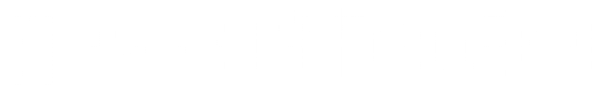

---

<h1> Universidad Rafael Urdaneta </h1>

<strong>¡Bienvenido a mi repositorio académico!</strong> Este espacio documenta mi trayectoria durante el trimestre, donde guardare todos mis ejercicios, prácticas y proyectos desarrollados en la materia de <strong>Programación 2.</strong>

<strong> Formación Académica: </strong>

- **Bachillerato:** Unidad Educativa Colegio Mater Salvatoris.
- **Actualmente:** 4to trimestre de Ingeniería en la URU.
- **Extras:** Forme parte del equipo de robotica de mi colegio, ademas de formar parte de las becas de robotica del estado.

<strong> Experiencia en Programación: </strong>

- **Robótica Educativa:** Programación en bloques, Python, Arduino.
- **Fundamentos:** Programación I.
- **Actualmente aprendiendo:** Programación 2 con C++, proyectos personales con CSS y HTML.

- **Laptop:** VivoBook ASUS.
- **Editor de código:** VS Code.
- **Compilador:** MinGW.
- **Sistema operativo:** Windows 11.

